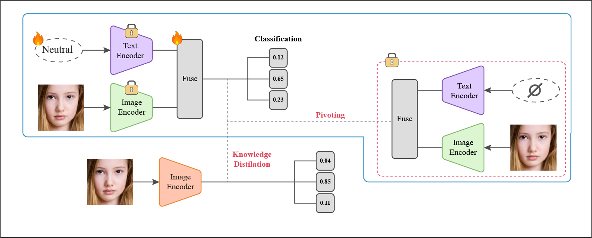

<p align="center">
  <h1 align="center">N-TIDE: Debiasing Unimodal Vision Models via Neutral Text Inversion with CLIP</h1>
  <p align="center">
    <a>Chanhee Lee</a>
    ·
    <a>Jinho Jang</a>
    ·
    <a>Sarang Han</a>
  </p>
  <p align="center">
    <i>Sungkyunkwan University · Department of Applied Artificial Intelligence</i><br>
    <i>2025-Spring Introduction to Deep Learning Course Term Project</i>
  </p>
</p>

---
## 📄 [Paper](https://drive.google.com/file/d/1XQGbxueJkxlq0xKpMo7ILOakWykr1_zk/view?usp=sharing)

### 🖼️ Model Overview


---

## 📝 Abstract

Mitigating bias in vision models is challenging, particularly when semantic attributes subtly influence predictions. While vision-language models like CLIP provide strong debiasing signals, they require text input at inference, limiting their use in image-only settings. We introduce **N-TIDE** (Neutral Text-Inversion for Distillation-based Equilibration), a two-stage framework that distills CLIP’s fairness guidance into a unimodal vision model. In the first stage, we propose a novel *neutral-text inversion* process, which regularizes the model by aligning a trainable neutral-text embedding with CLIP’s null-text embedding. This alignment captures semantic debiasing cues without requiring text at test time. In the second stage, we transfer these cues into an image-only encoder via cosine-based feature matching. We further interpret this process through the lens of deterministic diffusion, framing semantic alignment as a guided trajectory.

Experiments on FairFace show that N-TIDE improves fairness metrics such as Equalized Odds and Representation Bias Difference with minimal accuracy loss. Though the fairness gains are moderate and the diffusion analogy remains conceptual, N-TIDE offers a practical path to integrating multimodal supervision into efficient vision-only models.


---

## :sparkles: N-TIDE: Neutral Text-Inversion for Distillation-based Equilibration

## 1. Installation

To install the project, follow the steps below:

1. Clone the repository using the following command:

   ```
   git clone https://github.com/iontail/N-TIDE.git
   ```

2. Move to the cloned project directory:

   ```
   cd N-TIDE
   ```

3. Create a new virtual environment and install the required packages:

   ```
   conda create -n N_TIDE python=3.10   # Run this command only once
   conda activate N_TIDE  
   pip install -r requirements.txt
   ```

4. Set up the dataset and run the code:

   ```
   python train.py --dataset_name "FairFace"                       # FairFace, Race 7-class
   python train.py --dataset_name "FairFace" --is_fairface_race_4  # FairFace, Race 4-class (White, Black, Asian, Indian)
   ```

5. Deactivate the virtual environment:

   ```
   conda deactivate
   ```

---


## 📚 Citation

> This work was completed as part of the 2025-Spring *Introduction to Deep Learning* course term project at Sungkyunkwan University. Although the paper is not officially published, if you wish to cite it in your work, please use the following BibTeX entry:

```bibtex
@misc{lee2024ntide,
  title        = {N-TIDE: Debiasing Unimodal Vision Models via Neutral Text Inversion with CLIP},
  author       = {Lee, Chanhee and Jang, Jinho and Han, Sarang},
  year         = {2024},
  howpublished = {https://github.com/iontail/N-TIDE},
  url          = {https://github.com/iontail/N-TIDE}
}